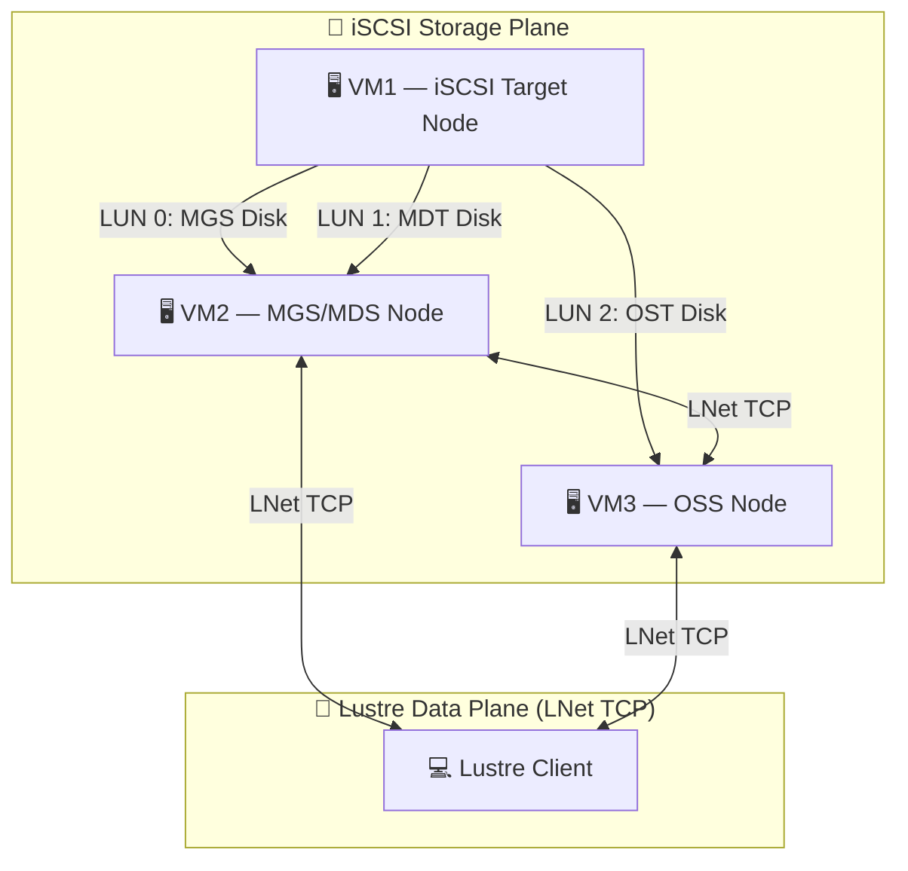

<div align="center">

# 🌌 Lustre Cluster iSCSI Orchestrator

**A Rust-powered automation engine for deploying enterprise-grade distributed storage on a 3-VM VirtualBox cluster.**

[](https://www.rust-lang.org/)
[](LICENSE)
[](https://www.redhat.com/)

*Automates the full lifecycle of iSCSI + LustreFS — from raw disk export to a unified parallel filesystem — without a single manual command.*

</div>

---

## 📖 What Is This Project?

This is an **educational Software-Defined Storage (SDS)** implementation that shows how enterprise storage technologies — **iSCSI** and **LustreFS** — work together to provide centralized, high-performance, network-accessible storage.

Instead of executing dozens of complex Linux commands, you run a **single Rust application** that handles the entire cluster setup interactively.

---

## 🏗️ Cluster Architecture

The system runs on **3 VirtualBox VMs**, each playing a dedicated role:

```
┌─────────────────────────────────────────────────────────────────┐
│                     iSCSI Storage Plane                         │
│                                                                 │
│  ┌─────────────────┐                                            │
│  │  VM 1           │  LUN 0 ──► MGS/MDS Node                   │
│  │  iSCSI Target   │  LUN 1 ──► MGS/MDS Node                   │
│  │  (Storage)      │  LUN 2 ──────────────────► OSS Node        │
│  └─────────────────┘                                            │
└─────────────────────────────────────────────────────────────────┘
┌─────────────────────────────────────────────────────────────────┐
│                     Lustre Data Plane (LNet/TCP)                 │
│                                                                 │
│   ┌────────────┐   ◄──────►   ┌──────────┐                     │
│   │  VM 2      │              │  VM 3    │                     │
│   │  MGS / MDS │   ◄──────►   │  OSS/OST │                     │
│   └────────────┘              └──────────┘                     │
│          ▲                         ▲                           │
│          └──────────┬──────────────┘                           │
│                     ▼                                          │
│              ┌─────────────┐                                   │
│              │ Lustre Client│  /mnt/lustre  ← User accesses    │
│              └─────────────┘    here                          │
└─────────────────────────────────────────────────────────────────┘
```



---

## 🔄 Orchestration Sequence

```mermaid
sequenceDiagram
    autonumber
    participant T  as 🖥️ iSCSI Target
    participant M  as 🗂️ MGS/MDS Node
    participant O  as 📦 OSS Node
    participant C  as 💻 Lustre Client

    rect rgb(20, 20, 40)
        Note over T,C: Phase 1 — Package Prerequisites
        T->>T: Install targetcli-fb & start service
        M->>M: Install open-iscsi / iscsi-initiator-utils & start service
        O->>O: Install open-iscsi / iscsi-initiator-utils & start service
    end

    rect rgb(20, 40, 20)
        Note over T: Phase 2 — Create iSCSI LUNs
        T->>T: Allocate image files (mgs.img, mdt.img, ost.img)
        T->>T: Register TPG & map LUN 0, LUN 1, LUN 2
        T->>T: Enable writeable demo ACLs
    end

    rect rgb(40, 20, 20)
        Note over M,O: Phase 3 — Connect Initiator Nodes
        M->>T: Discover & login to iSCSI Target (LUN 0 & LUN 1)
        O->>T: Discover & login to iSCSI Target (LUN 2)
    end

    rect rgb(40, 40, 20)
        Note over M,O: Phase 4 — Format & Mount Lustre Services
        M->>M: Format LUN 0 → mkfs.lustre --mgs → Mount /mnt/mgs
        M->>M: Format LUN 1 → mkfs.lustre --mdt --mgsnode → Mount /mnt/mdt
        O->>O: Format LUN 2 → mkfs.lustre --ost --mgsnode → Mount /mnt/ost
    end

    rect rgb(20, 40, 40)
        Note over C: Phase 5 — Client Mount & Verify
        C->>C: Mount Lustre filesystem from MGS/MDS NID
        C->>C: Perform write/read verification check
    end
```



---

## 🚀 Getting Started

### 1. Prerequisites

| Requirement | Details |
|---|---|
| **OS** | RHEL 8 / Rocky Linux 8 (or Ubuntu for iSCSI initiator) |
| **VMs** | 3× VirtualBox VMs with host-only or internal network |
| **SSH** | Passwordless SSH access from control node to all VMs |
| **Rust** | `cargo` available (run `rust_install.sh` if needed) |
| **Lustre** | Kernel modules pre-installed (run `build_lustre.sh` on servers) |

> [!TIP]
> Set up passwordless SSH to each node before running the orchestrator:
> ```bash
> ssh-copy-id root@<node-ip>
> ```

### 2. Install Dependencies

Run the appropriate helper scripts on each machine:

```bash
# On the iSCSI Target node (Ubuntu-based):
sudo ./iscsi_install.sh

# On MGS/MDS and OSS nodes (RHEL/Rocky-based) — builds Lustre from source:
sudo ./build_lustre.sh

# On the control node — installs Rust + Cargo:
./rust_install.sh
```

> [!IMPORTANT]
> `build_lustre.sh` takes **10–30 minutes** to compile Lustre from source and **reboots the system** at the end. This is expected behavior.

### 3. Build the Orchestrator

```bash
cd /path/to/iscsi
cargo build --release
```

### 4. Run the Application

```bash
sudo ./target/release/iscsi_setup
```

You will be greeted with the interactive main menu:

```
╔══════════════════════════════════════════════════════════╗
║           Lustre & iSCSI Storage Orchestrator            ║
╚══════════════════════════════════════════════════════════╝

--- Main Menu ---
1. Create iSCSI Target (Local Target Server)
2. Delete iSCSI Target (Local Target Server)
3. Configure Lustre MGS Server
4. Configure Lustre MDS Server
5. Configure Lustre OSS Server (Object Storage Server / OST)
6. Connect as Storage Client (Mount LustreFS)
7. Unmount & Release Storage (Safe Teardown)
8. Multi-Node Cluster Orchestrator (One-Shot Deploy/Teardown)
9. Exit
```

### 5. One-Shot Cluster Deploy

Select **Option 4 – Multi-Node Cluster Orchestrator**. You will be prompted for:

- IP addresses of all nodes
- SSH usernames
- Mount points & disk allocation sizes

The orchestrator saves your inputs to `cluster_config.json` so you can **reload and re-deploy in a single click** on future runs.

---

## 🔁 Cluster Teardown (Backoff)

Within the Orchestration menu, choose **Option 2 – Cluster Teardown / Backoff**. The teardown runs the following cleanup steps in reverse dependency order:

| Step | Action |
|---|---|
| 1 | Unmount Lustre client filesystem on the Client node |
| 2 | Unmount OST on the OSS node |
| 3 | Unmount MDT on the MGS/MDS node |
| 4 | Unmount MGS on the MGS/MDS node |
| 5 | Log out of iSCSI targets on all initiator nodes |
| 6 | Delete iSCSI target definitions, LUNs & backstores |
| 7 | Delete physical image files to free disk space |
| 8 | Restart the iSCSI target service cleanly |

---

## 📁 Project Structure

```
iscsi/
├── src/
│   ├── main.rs          # iSCSI target setup, deletion, main menu
│   └── dcv.rs           # Lustre orchestration, SSH automation, cluster config
├── build_lustre.sh      # Builds Lustre kernel modules from source (RHEL/Rocky)
├── iscsi_install.sh     # Installs iSCSI target packages (Ubuntu/Debian)
├── rust_install.sh      # Installs Rust + Cargo toolchain
├── test_lustre.sh       # Spins up a single-node loopback Lustre test cluster
├── Cargo.toml           # Rust project manifest
└── Readme.md            # This file
```

---

## 🩺 Troubleshooting

> [!WARNING]
> If a Lustre format command fails, check whether kernel modules are loaded on that node:
> ```bash
> lsmod | grep -E "lustre|lnet"
> ```
> If not loaded:
> ```bash
> modprobe lustre
> # or run the prerequisite package installer via the utility menu
> ```

> [!IMPORTANT]
> The orchestrator uses deterministic block device paths:
> ```
> /dev/disk/by-path/ip-<target>:3260-iscsi-<target_iqn>-lun-<lun_id>
> ```
> If these paths don't appear after iSCSI login, verify the daemon is active on the initiator:
> ```bash
> systemctl status iscsid
> ```

> [!NOTE]
> If `cluster_config.json` exists in the working directory, the orchestrator will ask if you want to reload your previous configuration — saving you from re-entering all IPs and parameters.

---

## 🎓 Educational Concepts Covered

| Concept | Technology |
|---|---|
| Network Block Storage | iSCSI (Internet Small Computer Systems Interface) |
| Storage Targets & LUNs | `targetcli-fb`, `rtslib-fb` |
| iSCSI Initiators | `open-iscsi`, `iscsiadm` |
| Distributed Filesystem | LustreFS (MGS, MDS, OSS, OST, Client) |
| Filesystem Networking | LNet (Lustre Networking) over TCP |
| Metadata Management | MDT (Metadata Target) on MDS |
| Object Storage | OST (Object Storage Target) on OSS |
| Infrastructure Automation | Rust + SSH + `std::process::Command` |
| Storage-as-Code | Declarative cluster config via JSON |

---

## 🌐 End-User Experience

From the user's perspective, the distributed storage is completely transparent:

```bash
# After the orchestrator finishes, on any client machine:
cd /mnt/lustre

mkdir ProjectFiles
cp ~/report.pdf /mnt/lustre/
echo "Hello SDS" > notes.txt
ls -lh
```

Behind the scenes, iSCSI exports the block devices, MGS/MDS manages the namespace and metadata, and OSS/OST stores the file chunks — all invisible to the end user.

---

## ⚠️ Disclaimer

> This project is intended **solely for educational purposes**. It is a lightweight proof-of-concept for a small VirtualBox cluster. It is **not** intended for production use.

---

<div align="center">
Built for learning • Powered by Rust • Distributed with Lustre
</div>