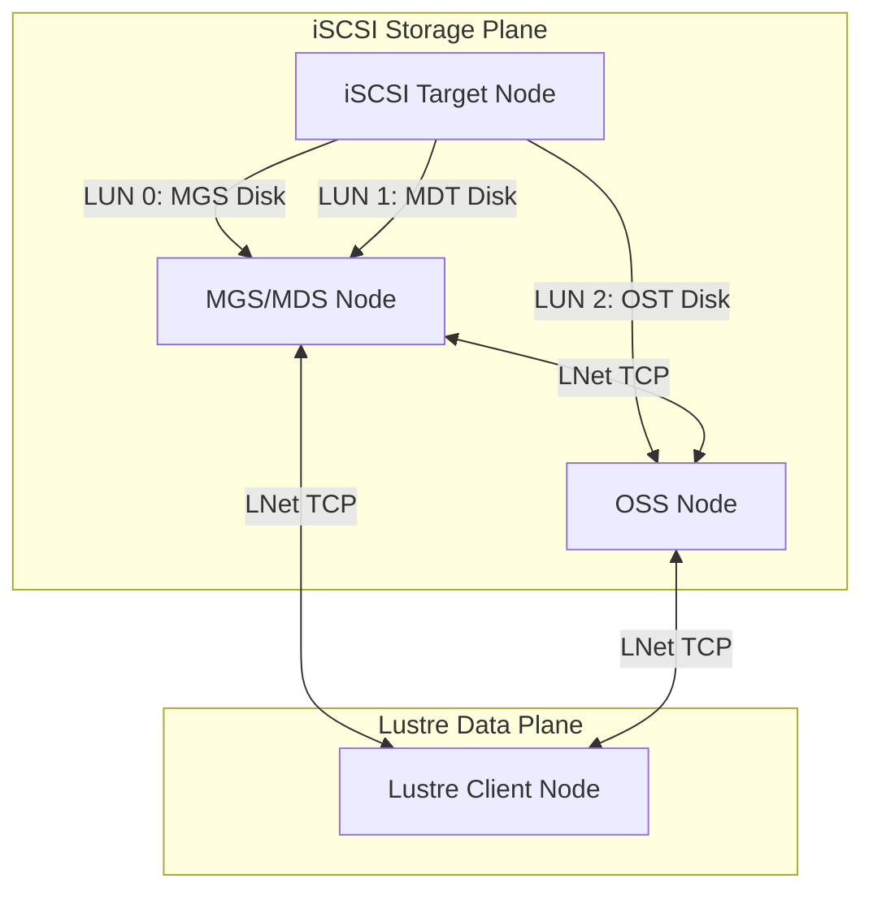

# 🌌 LustreFS on Network Block Storage

An automated Rust-based utility to orchestrate and deploy a multi-node **Lustre Parallel Filesystem** cluster using **iSCSI shared block storage**.

This orchestrator handles the entire lifecycle (one-command setup and automated teardown/backoff) of a cluster consisting of:
1. **iSCSI Target (Storage Node):** Provisions file-backed disks and exports them as SCSI LUNs.
2. **MGS/MDS Node (Combined):** One node running both the Management Server (MGS) and Metadata Server (MDS / MDT).
3. **OSS Node (Object Storage Server):** One node running the Object Storage Target (OST) storing raw data chunks.
4. **Lustre Client:** A client node mounting the unified parallel storage volume.

---

## 🛠️ Cluster Architecture & Data Flow



---

## 📋 Orchestration Sequence

The deployment runs in a single execution of a function (`orchestrate_cluster`) following a strict dependency sequence:

```mermaid
sequenceDiagram
    autonumber
    participant Target as iSCSI Target
    participant Server as MGS/MDS Node
    participant OSS as Object Storage Node (OSS)
    participant Client as Lustre Client

    rect rgb(20, 20, 30)
        Note over Target,Client: Phase 1: Package Prerequisites
        Target->>Target: Install targetcli-fb & start service
        Server->>Server: Install open-iscsi / iscsi-initiator-utils & start service
        OSS->>OSS: Install open-iscsi / iscsi-initiator-utils & start service
    end

    rect rgb(20, 30, 20)
        Note over Target: Phase 2: Create iSCSI LUNs
        Target->>Target: Allocate image files (mgs.img, mdt.img, ost.img)
        Target->>Target: Register TPG & map LUN 0, 1, 2
        Target->>Target: Enable writeable demo ACLs
    end

    rect rgb(30, 20, 20)
        Note over Server,OSS: Phase 3: Connect Initiator Nodes
        Server->>Target: Discover & login to iSCSI Target (exposes LUN 0 & LUN 1)
        OSS->>Target: Discover & login to iSCSI Target (exposes LUN 2)
    end

    rect rgb(30, 30, 20)
        Note over Server,OSS: Phase 4: Format & Mount Lustre Services
        Server->>Server: Wait for LUN 0 -> Format --mgs -> Mount /mnt/mgs
        Server->>Server: Wait for LUN 1 -> Format --mdt --mgsnode=<server_nid> -> Mount /mnt/mdt
        OSS->>OSS: Wait for LUN 2 -> Format --ost --mgsnode=<server_nid> -> Mount /mnt/ost
    end

    rect rgb(20, 30, 30)
        Note over Client: Phase 5: Client Mount & Verify
        Client->>Client: Mount lustre filesystem from MGS/MDS NID
        Client->>Client: Perform write/read verification check
    end
```



---

## 🚀 Getting Started

### 1. Prerequisites & Network Configuration
- Ensure all target and initiator nodes can reach each other via IP network.
- Setup **passwordless SSH access** from the control node (where you compile and run this utility) to all target nodes (MGS/MDS, OSS, Client, and Target).
  > [!TIP]
  > You can copy your SSH key to each node using:
  > ```bash
  > ssh-copy-id root@<node-ip>
  > ```
- The kernel modules and Lustre packages should be pre-installed on the servers. (Refer to `build_lustre.sh` to compile/install Lustre modules if needed).

### 2. Compile the Utility
Compile the tool using Cargo:
```bash
cargo build --release
```

### 3. Running the Orchestrator
Execute the program:
```bash
sudo ./target/release/iscsi_setup
```

From the Main Menu, choose:
- **`4. Multi-Node Cluster Orchestrator (One-Shot Deploy/Teardown)`**

You will be prompted to enter the IP addresses, SSH usernames, mount points, and allocations for all nodes. 
> [!NOTE]
> The orchestrator automatically saves your inputs to `cluster_config.json` in the working directory, allowing you to reload and run deployments or teardowns in a single click next time.

---

## 🔄 Cluster Backoff (Teardown)

To safely tear down the cluster and clean up all resources, choose option **`2) Cluster Teardown / Backoff (Cleanup)`** within the Orchestration menu.

The teardown process executes the following steps:
1. **Unmounts** the Lustre client filesystem on the Client node.
2. **Unmounts** the OST target filesystem on the OSS node.
3. **Unmounts** the MDT (Metadata Target) filesystem on the combined MGS/MDS node.
4. **Unmounts** the MGS (Management Target) filesystem on the combined MGS/MDS node.
5. **Logs out** of the iSCSI targets on the initiator nodes (MGS/MDS, OSS) and clears target records.
6. **Deletes** target definitions, LUNs, and backstores on the iSCSI Target node via `targetcli`.
7. **Deletes** the physical image files on the Target node storage directory to free up block storage space.
8. **Restarts** the target service to apply configurations cleanly.

---

## 🩺 Troubleshooting

> [!WARNING]
> If a Lustre format command fails, check if the kernel modules (`lustre`, `lnet`) are loaded on that node:
> ```bash
> lsmod | grep -E "lustre|lnet"
> ```
> If not loaded, run `modprobe lustre` or run the prerequisite package installer in the utility.

> [!IMPORTANT]
> Deterministic block path links `/dev/disk/by-path/ip-<target>:3260-iscsi-<target_iqn>-lun-<lun_id>` are used. If they don't appear, verify the iSCSI daemon is active on the initiator nodes:
> ```bash
> systemctl status iscsid
> ```
